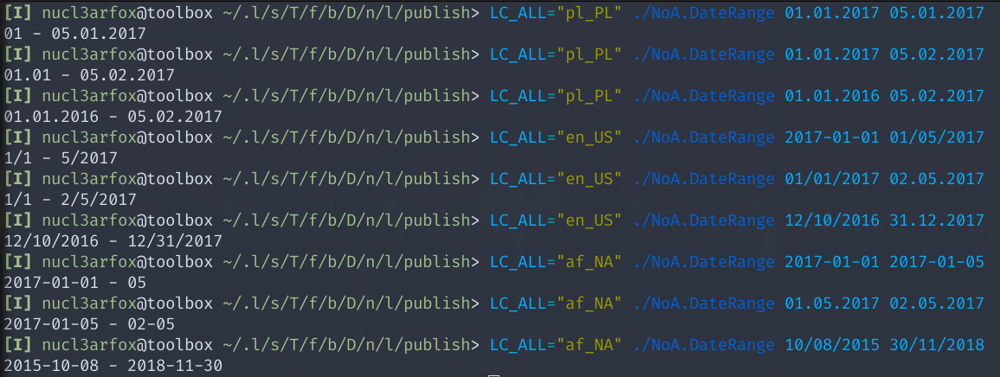

<h1>NoA Date Range</h1>

Console app that takes two date strings as an input and shows date range between them as an output.

<h2>Locale dependency</h2>

    Both application input and output is dependant on current thread's locale settings. It is set by the OS most of the time but you can use environment variable (LC_ALL on Linux) to change it temporarly. 

    Following variables are defined:

<ul>
    <li><b>Y</b> - format of date <b>year</b> fragmet e.g. <i>"yyyy"</i> or <i>"yy"</i></li>
    <li><b>M</b> - format of date <b>month</b> fragmet e.g. <i>"MM"</i> or <i>"M"</i></li>
    <li><b>D</b> - format of date <b>dat</b> fragmet e.g. <i>"dd"</i> or <i>"d"</i></li>
    <li><b>/</b> - format of date <b>separator</b> e.g. <i>'/'</i> or <i>'.'</i></li>
</ul>

<h3>Input</h3>

    App takes two and only two arguments and tries to parse them to DateOnly struct. 

    Arguments parsing has three possible results:

<ol>
    <li>Passed string is valid date in current thread culture e.g. <i>"Y-M-D"</i> or <i>"M/D/Y"</i> for <b>en_US</b> locale</li>
    <li>
        Passed string is not valid date format for current culture, thus app tries to parse it with available specific cultures.
        First culture for which date format is valid is taken for parsing.
    </li>
    <li>Passed string does not contain any valid date formats, thus program finishes execution.</li>
</ol>

<h3>Output</h3>

    Output format is always dependent on current culture default date format. 

    Following arguments are defined:

<ul>
    <li><i>y1, y2</i> - to express <b><i>year</i></b> value of start date and end date of date range</li>
    <li><i>m1, m2</i> - to express <b><i>month</i></b> value of start date and end date of date range</li>
    <li><i>d1, d2</i> - to express <b><i>day</i></b> value of start date and end date of date range</li>
</ul>
<table>
<thead>
    <tr>
        <th>Culture's date format</th>
        <th>if y1 == y2 and m1 == m2</th>
        <th>if y1 != y2 and m1 == m2</th>
        <th>in all other cases</th>
    </tr>
</thead>
<tbody>
    <tr>
        <td><b>Y / M / D</b> <i>(big-endian)</i></td>
        <td>y1<b>/</b>m1<b>/</b>d1 - d2</td>
        <td>y1<b>/</b>m1<b>/</b>d1 - m2<b>/</b>d2</td>
        <td>y1<b>/</b>m1<b>/</b>d1 - y2<b>/</b>m2<b>/</b>d2</td>
    </tr>
    <tr>
        <td><b>D / M / Y</b> <i>(little-endian)</i></td>
        <td>d1 - d2<b>/</b>m2<b>/</b>y2</td>
        <td>d1<b>/</b>m1 - d2<b>/</b>m2<b>/</b>y2</td>
        <td>d1<b>/</b>m1<b>/</b>y1 - d2<b>/</b>m2<b>/</b>y2</td>
    </tr>
    <tr>
        <td><b>M / D / Y</b> <i>(middle-endian)</i></td>
        <td>m1<b>/</b>d1 - d2<b>/</b>y2</td>
        <td>m1<b>/</b>d1 - m2<b>/</b>d2<b>/</b>y2</td>
        <td>m1<b>/</b>d1<b>/</b>y1 - m2<b>/</b>d2<b>/</b>y2</td>
    <tr>
</tbody>
</table>

<h2>Binary releases</h2>

You can download one of realeases I published for you:

<ul>
    <li><a target="_blank" href="https://drive.protonmail.com/urls/77HN2VQJXW#B8sk8aDh2QLh">win-x64</a></li>
    <li><a target="_blank" href="https://drive.protonmail.com/urls/7KAXP0CMRW#CR2otxLskcHd">win-x86</a></li>
    <li><a target="_blank" href="https://drive.protonmail.com/urls/F144QYNSDR#FoWwm18JMbTi">linux-x64</a></li>
    <li><a target="_blank" href="https://drive.protonmail.com/urls/54FN4VYQ3W#IMUXzzQsxzaU">linux-arm</a></li>
    <li><a target="_blank" href="https://drive.protonmail.com/urls/8RXQ117J30#6GZJOOFYZYwk">osx-x64</a></li>
</ul>

or build it on your own using guide in next section.

<h2>Build guide</h2>

<h3>Windows x64</h3>

    Thanks to build configuration written in <b><i>NoA.DateRange/NoA.DateRange.csproj</i></b> Windows build is super easy. 

    While in repo's root directory execute:

> $ dotnet publish -c Release

You'll find executable in <i><b>NoA.DateRange/bin/Release/net6.0/win-x64/publish/</b></i> folder.

<h3>Other OS</h3>

    If you need to build app for other OS like linux or macOS first you'll need to check its runtime ID (RID):

<ul>
    <li>Go to <a target="_blank" href="https://docs.microsoft.com/en-us/dotnet/core/rid-catalog">.NET RID Catalog</a> and find the one that is right for your OS</li>
    <li>Most popular RIDs will be <i>linux-x64</i>, <i>osx-x64</i> and <i>win-x64</i> (used implicityly in MSBuild)</li>
</ul>

    While in repo's root directory execute:

> $ dotnet publish -c Release -r <i>&#60;RID&#62;</i> --self-contained 

You'll find executable in <i><b>NoA.DateRange/bin/Release/net6.0/&#60;RID&#62;/publish/</b></i> folder.

<h2>Troubleshooting</h2>

<h3>Disable trimming</h3>

If you'll encounter any problems with the app please try replacing following line in <b><i>NoA.DateRange/NoA.DateRange.csproj</i></b> file:

> &#60;PublishTrimmed&#62;true&#60;/PublishTrimmed&#62;

with 

> &#60;PublishTrimmed&#62;false&#60;/PublishTrimmed&#62;

This line enables so-called <a target="_blank" href="https://docs.microsoft.com/en-us/dotnet/core/deploying/trimming/trimming-options">trimming</a> that may cause problems with dependencies for some of the builds.

<h3>Lack of libicu on Linux</h3>

Make sure you have installed <a target="_blank" href="https://pkgs.org/download/libicu">libicu</a> or another substitute library that provides globalization functionalities.
